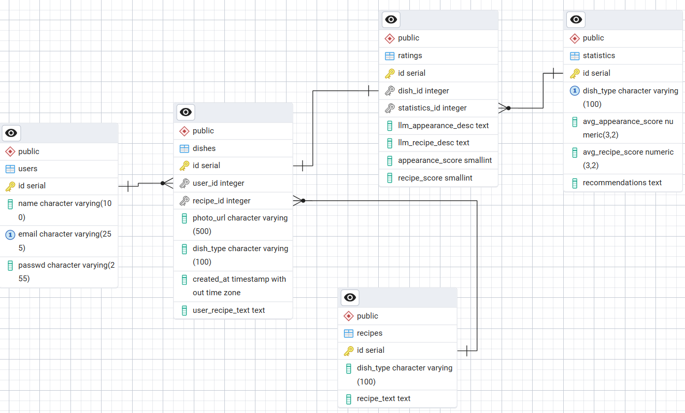
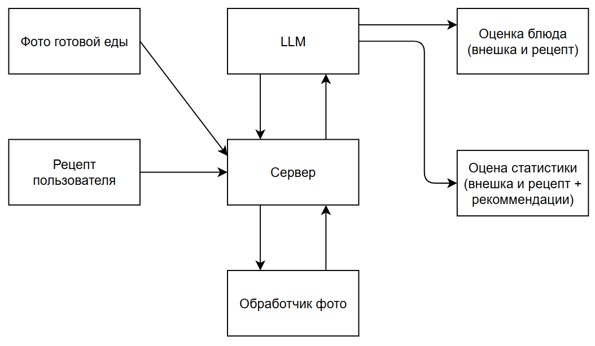

# База данных "Умный помощник для повышения навыков готовки"

## Общее описание

База данных предназначена для системы умного помощника в кулинарии, которая помогает пользователям улучшать свои навыки готовки через анализ приготовленных блюд, оценку их качества и предоставление персонализированных рекомендаций.

---

## Структура базы данных

### Диаграмма связей



## Схема данных для LLM

### Таблицы базы данных

## 1. Таблица `users` - Пользователи

**Назначение:** Хранение информации о зарегистрированных пользователях системы.

| Поле | Тип данных | Ограничения | Описание |
|------|------------|-------------|-----------|
| `id` | `serial` | `PRIMARY KEY` | Уникальный идентификатор пользователя |
| `name` | `character varying(100)` | - | Имя пользователя |
| `email` | `character varying(255)` | - | Email адрес (уникальный) |
| `passwd` | `character varying(255)` | - | Хэш пароля |

**Индексы:**
- `idx_users_email` - для быстрой авторизации по email

---

## 2. Таблица `recipes` - Рецепты

**Назначение:** База стандартных рецептов блюд.

| Поле | Тип данных | Ограничения | Описание |
|------|------------|-------------|-----------|
| `id` | `serial` | `PRIMARY KEY` | Уникальный идентификатор рецепта |
| `dish_type` | `character varying(100)` | - | Тип/категория блюда |
| `recipe_text` | `text` | - | Текст рецепта |

---

## 3. Таблица `dishes` - Приготовленные блюда

**Назначение:** Хранение информации о блюдах, приготовленных пользователями.

| Поле | Тип данных | Ограничения | Описание |
|------|------------|-------------|-----------|
| `id` | `serial` | `PRIMARY KEY` | Уникальный идентификатор блюда |
| `user_id` | `integer` | `FOREIGN KEY (users.id)` | ID пользователя, приготовившего блюдо |
| `recipe_id` | `integer` | `FOREIGN KEY (recipes.id)` | ID использованного рецепта |
| `photo_url` | `character varying(500)` | - | Ссылка на фото приготовленного блюда |
| `dish_type` | `character varying(100)` | - | Тип блюда |
| `created_at` | `timestamp` | - | Дата и время создания записи |
| `user_recipe_text` | `text` | - | Текст рецепта с пользовательскими изменениями |

**Индексы:**
- `idx_dishes_user_id` - для поиска блюд пользователя
- `idx_dishes_recipe_id` - для поиска по рецептам
- `idx_dishes_created_at` - для сортировки по дате

---

## 4. Таблица `ratings` - Оценки блюд

**Назначение:** Хранение оценок и обратной связи по приготовленным блюдам.

| Поле | Тип данных | Ограничения | Описание |
|------|------------|-------------|-----------|
| `id` | `serial` | `PRIMARY KEY` | Уникальный идентификатор оценки |
| `dish_id` | `integer` | `FOREIGN KEY (dishes.id)` | ID оцененного блюда |
| `statistics_id` | `integer` | `FOREIGN KEY (statistics.id)` | ID связанной статистики |
| `lim_appearance_desc` | `text` | - | Описание внешнего вида (от LIM) |
| `lim_recipe_desc` | `text` | - | Описание рецепта (от LIM) |
| `appearance_score` | `smallint` | - | Оценка внешнего вида (1-10) |
| `recipe_score` | `smallint` | - | Оценка рецепта/вкуса (1-10) |

**Индексы:**
- `idx_ratings_dish_id` - для поиска оценок по блюду
- `idx_ratings_statistics_id` - для связи со статистикой

---

## 5. Таблица `statistics` - Статистика и рекомендации

**Назначение:** Агрегированная статистика и AI-рекомендации для пользователей.

| Поле | Тип данных | Ограничения | Описание |
|------|------------|-------------|-----------|
| `id` | `serial` | `PRIMARY KEY` | Уникальный идентификатор статистики |
| `dish_type` | `character varying(100)` | - | Тип блюда для анализа |
| `avg_appearance_score` | `numeric(3,2)` | - | Средняя оценка внешнего вида |
| `avg_recipe_score` | `numeric(3,2)` | - | Средняя оценка рецепта |
| `recommendations` | `text` | - | Текст рекомендаций для улучшения |

---

## Связи между таблицами

### Внешние ключи:

1. **`dishes.user_id`** → `users.id`
   - Каждое блюдо связано с пользователем, который его приготовил

2. **`dishes.recipe_id`** → `recipes.id`
   - Блюдо может быть связано с рецептом из базы

3. **`ratings.dish_id`** → `dishes.id`
   - Оценки привязаны к конкретным блюдам

4. **`ratings.statistics_id`** → `statistics.id`
   - Оценки связаны с агрегированной статистикой

---

## Индексы для производительности

### Созданные индексы:

```sql
-- Users
CREATE INDEX idx_users_email ON users(email);

-- Dishes
CREATE INDEX idx_dishes_user_id ON dishes(user_id);
CREATE INDEX idx_dishes_recipe_id ON dishes(recipe_id);
CREATE INDEX idx_dishes_created_at ON dishes(created_at);

-- Ratings
CREATE INDEX idx_ratings_dish_id ON ratings(dish_id);
CREATE INDEX idx_ratings_statistics_id ON ratings(statistics_id);
```

### Обоснование индексов:

- **Поля JOIN операций** - все FK индексированы для быстрых соединений
- **Поисковые поля** - email, user_id для частых запросов
- **Сортировочные поля** - created_at для хронологического отображения
- **Уникальные поля** - email для предотвращения дубликатов

---

## Основные сценарии использования

### 1. Регистрация и авторизация
- Быстрый поиск пользователя по email при входе

### 2. Просмотр истории блюд
- Получение блюд пользователя с сортировкой по дате

### 3. Анализ прогресса
- Сравнение оценок по разным блюдам и категориям

### 4. Получение рекомендаций
- AI-анализ статистики для персонализированных советов

### 5. Поиск рецептов
- Быстрый доступ к базе рецептов по типам блюд

---

## Преимущества структуры

1. **Масштабируемость** - возможность добавления новых типов анализа
2. **Производительность** - оптимизированные индексы для частых запросов
3. **Гибкость** - поддержка пользовательских рецептов и модификаций
4. **Аналитика** - структура для сбора и анализа кулинарного прогресса
5. **Безопасность** - разделение данных пользователей

---

## Возможные расширения

1. Добавление таблицы `ingredients` для анализа используемых ингредиентов
2. Таблица `cooking_sessions` для отслеживания процесса готовки
3. Таблица `user_preferences` для персонализации рекомендаций
4. Таблица `achievements` для геймификации процесса обучения

Эта структура базы данных обеспечивает надежную основу для системы умного кулинарного помощника с возможностью дальнейшего масштабирования и добавления новых функций.