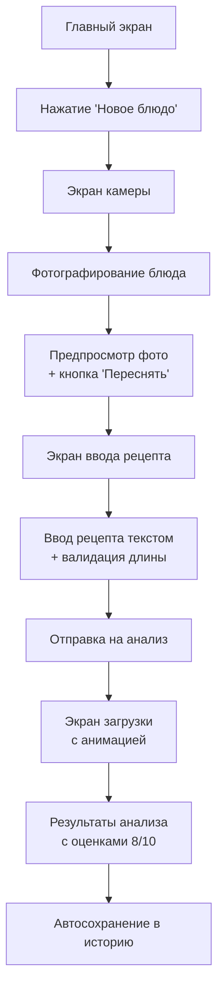
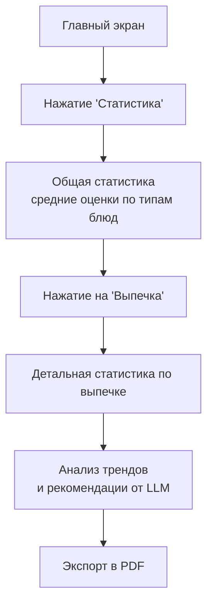
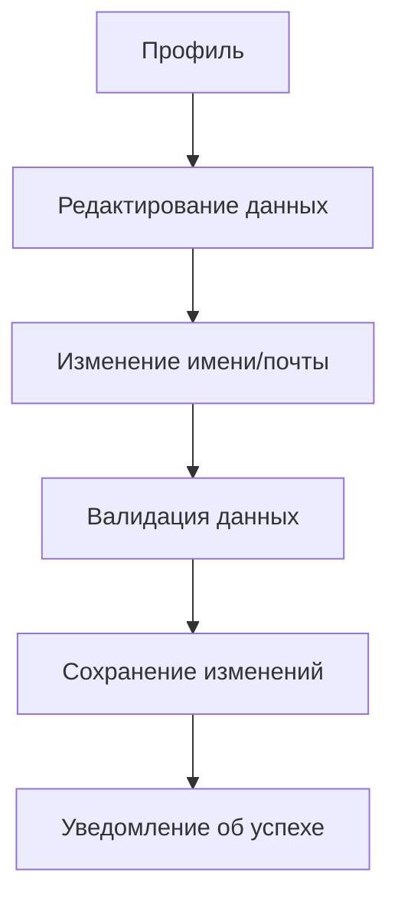

Отлично! Приступаю к созданию детальных UX-сценариев. 

## Детальные User Journey для ключевых Use-Cases

### 1. Use-Case: "Добавление и анализ нового блюда"

#### Happy Path (Идеальный сценарий)

**Пользователь:** Алекс, начинающий кулинар
**Цель:** Получить оценку и рекомендации для приготовленного блюда



**Детализация шагов:**

1. **Старт (0-3 сек)**
   - Алекс открывает приложение → видит главный экран с навигацией
   - Нажимает кнопку "Новое блюдо"
   - **Микроинтеракция:** плавная анимация перехода, кнопка имеет feedback при нажатии

2. **Фотографирование (3-15 сек)**
   - Открывается полноэкранный интерфейс камеры
   - Алекс фотографирует своё блюдо (паста карбонара)
   - **Микроинтеракция:** звук затвора, preview фото с затемнением экрана

3. **Подтверждение фото (15-25 сек)**
   - Показывается preview с кнопками "Использовать" и "Переснять"
   - Алекс подтверждает фото → переход к вводу рецепта
   - **Микроинтеракция:** плавное появление кнопок поверх фото

4. **Ввод рецепта (25-60 сек)**
   - Текстовое поле с плейсхолдером "Опишите рецепт, который вы использовали..."
   - Счетчик символов (min 50, max 2000)
   - Алекс вводит: "Паста карбонара: спагетти, бекон, яйца, пармезан..."
   - **Микроинтеракция:** валидация в реальном времени, кнопка отправки активируется при достаточном количестве текста

5. **Отправка на анализ (60-65 сек)**
   - Нажатие "Проанализировать" → показ экрана загрузки
   - **Микроинтеракция:** skeleton screen результатов, анимированный лоадер

6. **Обработка AI (65-85 сек)**
   - **Vision AI:** анализ фото (2-5 сек) → оценка внешнего вида
   - **LLM Processing:** анализ рецепта + результатов vision (10-15 сек)
   - **Точка взаимодействия с LLM:**
     ```prompt
     Пользователь приготовил блюдо по рецепту: "{user_recipe}"
     На фото блюдо выглядит так: "{vision_analysis}"
     
     Проанализируй:
     1. Соответствие результата рецепту (1-5)
     2. Общее качество исполнения (1-5)  
     3. Конструктивные рекомендации для улучшения
     ```

7. **Получение результатов (85-95 сек)**
   - Показываются две оценки: "Внешний вид: 4/5", "Соответствие рецепту: 3/5"
   - Детальные комментарии: "Паста выглядит аппетитно, но соус слишком жидкий..."
   - Рекомендации: "В следующий раз используйте меньше сливок и добавьте крахмал..."
   - **Микроинтеракция:** последовательная анимация появления оценок и текста

8. **Завершение (95-100 сек)**
   - Автоматическое сохранение в историю
   - Кнопка "Вернуться на главную"
   - **Микроинтеракция:** confetti анимация при высоких оценках (>4/5)

#### Edge Cases (Особые случаи)

**Case A: Плохое качество фото**
```
Пользователь делает размытое/темное фото
↓
Система определяет low quality изображение
↓
Показывается сообщение: "Качество фото низкое. 
Сделайте более четкий снимок при хорошем освещении"
↓
Предлагается переснять фото
```

**Case B: Слишком короткий рецепт**
```
Пользователь вводит "паста с сыром" (15 символов)
↓
Валидация показывает ошибку: "Опишите рецепт подробнее 
(минимум 50 символов)"
↓
Кнопка отправки неактивна до исправления
```

**Case C: Проблемы с сетью при анализе**
```
Отправка на анализ → пропадает соединение
↓
Показывается сообщение: "Проблемы с соединением"
↓
Автосохранение черновика в "Готовятся"
↓
При восстановлении связи → автоматическая повторная отправка
```

**Case D: Долгая обработка AI**
```
Анализ занимает >30 секунд
↓
Показывается прогресс-бар с estimated time
↓
Уведомление: "Анализ занимает больше времени из-за 
высокой нагрузки. Пожалуйста, подождите"
```

### 2. Use-Case: "Просмотр статистики и прогресса"

#### Happy Path

**Пользователь:** Мария, регулярно использующая приложение
**Цель:** Оценить свой прогресс в готовке



**Детализация:**

1. **Общая статистика (0-10 сек)**
   - Показываются карточки по типам блюд: "Выпечка 4.2/5", "Супы 3.8/5", "Салаты 4.5/5"
   - Визуализация прогресса: графики/диаграммы
   - **Микроинтеракция:** hover effects на карточках, плавное появление данных

2. **Детальная статистика (10-25 сек)**
   - Мария нажимает на "Выпечка" → открывается детальная страница
   - Показывается: история оценок, частые ошибки, прогресс во времени
   - **Точка взаимодействия с LLM:**
     ```prompt
     Проанализируй историю оценок пользователя по категории "Выпечка":
     {assessment_history}
     
     Выяви тенденции и дай 3 конкретных рекомендации для улучшения.
     Ответ в формате: trends[], recommendations[]
     ```

3. **Персонализированные рекомендации (25-35 сек)**
   - LLM генерирует: "Вы улучшили навыки работы с тестом, но стоит обратить внимание на температуру выпекания..."
   - Показываются конкретные советы с примерами
   - **Микроинтеракция:** анимация появления рекомендаций одна за другой

#### Edge Cases

**Case A: Мало данных для статистики**
```
У пользователя <5 блюд в истории
↓
Показывается: "Соберите больше данных для 
персонализированной статистики"
↓
Вместо графиков → мотивационные сообщения
```

**Case B: Резкое ухудшение показателей**
```
LLM обнаруживает падение оценок на 1.5+ балла
↓
Выделяется красным цветом на графике
↓
Генерируется специальное уведомление: 
"Заметили снижение качества? Возможно, стоит 
вернуться к базовым техникам"
```

### 3. Use-Case: "Работа с профилем и настройками"

#### Happy Path



**Edge Cases:**

**Case A: Неуникальный email**
```
Ввод существующего email при редактировании
↓
Мгновенная валидация: "Этот email уже используется"
↓
Подсветка поля красным
↓
Предложение восстановить доступ к старому аккаунту
```

**Case B: Удаление аккаунта**
```
Пользователь инициирует удаление аккаунта
↓
Показывается модальное окно с подтверждением
↓
Ввод пароля для подтверждения
↓
Поэтапное удаление: данные → фото → аккаунт
↓
Финальное уведомление об успешном удалении
```

### 4. Система обратной связи и микроинтеракций

**Уровни обратной связи:**
1. **Визуальная:** изменение цвета, анимации, иконки состояния
2. **Тактильная:** вибрация при успешных/неуспешных действиях
3. **Текстовая:** понятные сообщения об ошибках и успехах
4. **Прогресс-индикация:** для долгих операций (анализ AI)

**Критические точки UX:**
- Переход между камерой и вводом рецепта должен быть мгновенным
- Анализ AI не должен блокировать интерфейс
- Ошибки сети должны обрабатываться gracefully
- Данные должны автосохраняться при любом сценарии

**Моменты использования LLM:**
1. Анализ конкретного блюда (рецепт + фото)
2. Генерация персонализированных рекомендаций
3. Анализ трендов в статистике
4. Сравнение прогресса с предыдущими периодами

Такой подход обеспечивает плавный пользовательский опыт даже в неидеальных условиях и делает взаимодействие с AI-компонентами предсказуемым и понятным для пользователя.
