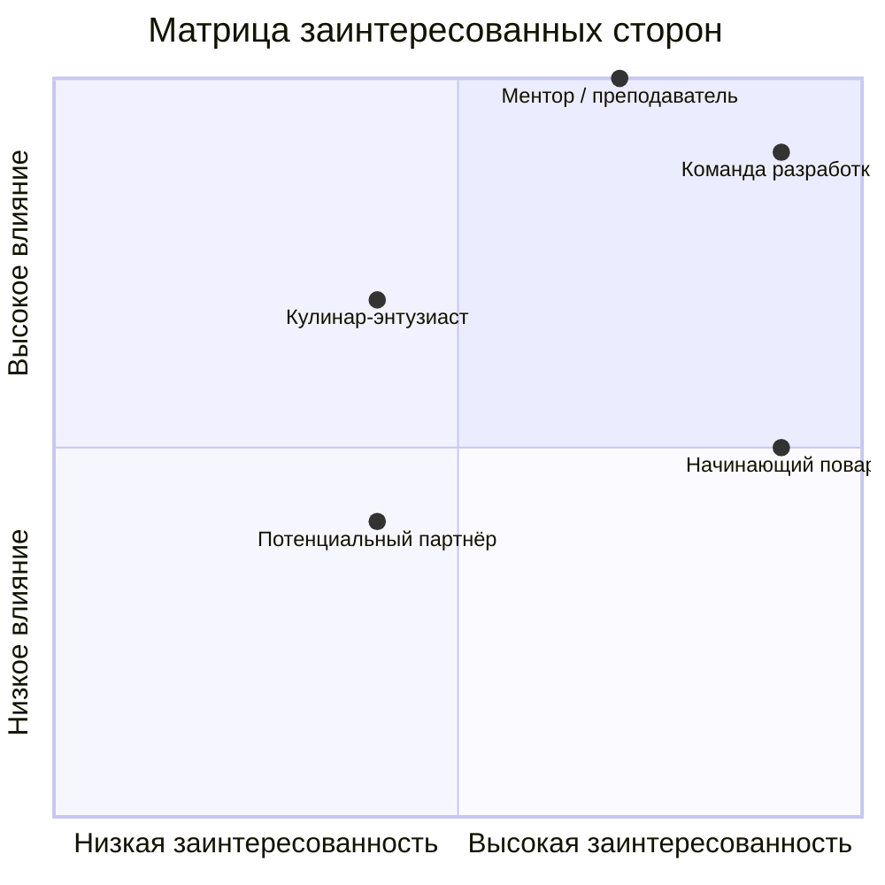

# D3 — Stakeholder Map  
Проект: *AI Food Assistant (Помощник-шеф на основе ИИ)*  

---

## Карта заинтересованных сторон

| Stakeholder | Влияние (1–3) | Заинтересованность (1–3) | Стратегия работы |
|--------------|----------------|---------------------------|------------------|
| Начинающий домашний повар | 2 | 3 | Вовлекать — опросы, тестирование, сбор обратной связи |
| Кулинар-энтузиаст | 2 | 3 | Вовлекать — фокус-группы, интервью, бета-тестирование |
| Команда разработки | 3 | 3 | Управлять — обновление задач и синхронизация в чате |
| Ментор / преподаватель | 3 | 2 | Консультироваться — регулярные отчёты, демонстрации прогресса |
| Потенциальный партнёр (спонсор / рекламодатель) | 2 | 2 | Информировать — презентации продукта, обсуждение монетизации |

---

## Классификация заинтересованных сторон

### Primary Stakeholders (Основные)
- Начинающий домашний повар — конечный пользователь, получает практическую пользу от оценки.  
  Взаимодействие: формы обратной связи, еженедельные опросы.  
- Кулинар-энтузиаст — продвинутый пользователь, источник экспертных отзывов.  
  Взаимодействие: фокус-группы и тестирование beta-версий.  

### Secondary Stakeholders (Вторичные)
- Команда разработки — создаёт продукт, обеспечивает стабильность и функциональность.  
  Взаимодействие: обновление задач и синхронизация в чате, планирование задач.  
- Ментор / преподаватель — обеспечивает контроль и направление развития проекта.  
  Взаимодействие: отчёты раз в 2 недели, консультации.  
- Потенциальный партнёр (спонсор) — заинтересован в будущем коммерческом применении.  
  Взаимодействие: ежеквартальные презентации и анализ рынка.  

---

## Матрица влияния / заинтересованности

---
## План коммуникаций

| Stakeholder                | Частота         | Формат                              | Ответственный        |
| -------------------------- | --------------- | ----------------------------------- | -------------------- |
| Начинающий повар       | Еженедельно     | Опросы, рассылки                    | Product Manager      |
| Кулинар-энтузиаст      | 2 раза в месяц  | Интервью, фокус-группы              | UX Researcher        |
| Команда разработки     | 2 раза в неделю | Синхронизация задач, чат-обсуждения | Tech Lead            |
| Ментор / преподаватель | Раз в 2 недели  | Онлайн-отчёты, демо                 | Project Manager      |
| Потенциальный партнёр  | Ежеквартально   | Презентации, встречи                | Business Development |
