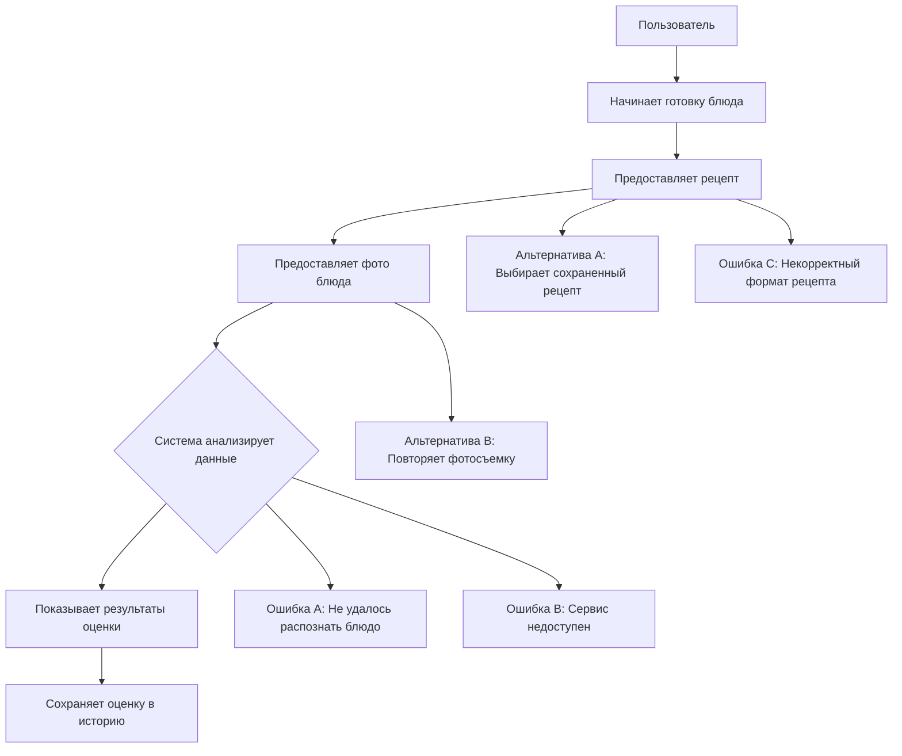

# D2 — Use-case Narrative: AI Food Assistant

## Основной Use-Case: Оценить готовое блюдо по новому рецепту

### Актор
**Пользователь (начинающий повар)** - роль пользователя, находящаяся вне системы

### Цель
Получить объективную оценку соответствия блюда рецепту и его внешней привлекательности

### Контекст
Пользователь впервые приготовил сложное блюдо "Тирамису" и хочет получить обратную связь

### Предусловия
- Пользователь зарегистрирован в системе
- Пользователь авторизован в системе
- У пользователя есть приготовленное блюдо для оценки

---

## Use-Case UML Диаграмма

---

## 1. Happy Path (Основной успешный сценарий)

| Шаг | Действие | Результат |
|-----|----------|-----------|
| 1 | Пользователь начинает процесс оценки блюда | Система запрашивает информацию о рецепте |
| 2 | Пользователь предоставляет текст рецепта | Система подтверждает получение рецепта |
| 3 | Пользователь предоставляет фотографию готового блюда | Система подтверждает получение фотографии |
| 4 | Пользователь подтверждает начало анализа | Система запускает процесс оценки |
| 5 | - | Система отображает результаты оценки: **Соответствие рецепту: 4/5**, **Внешний вид: 5/5** |
| 6 | - | Система сохраняет оценку в истории пользователя |

### Definition of Done для Happy Path
- [ ] Пользователь предоставил рецепт и фотографию блюда
- [ ] Система обработала запрос за время < 5 секунд
- [ ] Пользователь получил оценку по двум шкалам
- [ ] Результат сохранен в истории оценок
- [ ] Процесс завершился без ошибок

---

## 2. Alternative Flows (Альтернативные сценарии)

### Alternative Flow A: Отсутствует интернет-соединение

**Точка расширения:** Шаг 4 (подтверждение начала анализа)

| Шаг | Действие | Результат | Ценность |
|-----|----------|-----------|----------|
| 1 | Пользователь пытается отправить данные при отсутствии соединения | Система уведомляет о проблеме с интернет-соединением | Понятное объяснение причины проблемы |
| 2 | Пользователь восстанавливает соединение и повторяет отправку | Система продолжает процесс с момента остановки | Исключение необходимости повторного ввода данных |

### Alternative Flow B: Использование ранее сохраненного рецепта

**Точка расширения:** Шаг 2 (предоставление рецепта)

| Шаг | Действие | Результат | Ценность |
|-----|----------|-----------|----------|
| 1 | Пользователь выбирает рецепт из списка сохраненных | Система отображает список доступных рецептов | Быстрый доступ к часто используемым рецептам |
| 2 | Пользователь выбирает нужный рецепт | Система автоматически подставляет текст рецепта | Исключение ручного ввода |

---

## 3. Error Handling (Обработка ошибок)

### Ошибка A: Сервис оценки недоступен

**Ситуация:** AI-сервис временно не отвечает или возвращает ошибку

**Обработка:**
1. Система уведомляет о временной недоступности сервиса
2. Предлагает повторить попытку через некоторое время
3. Сохраняет введенные данные для повторной отправки

**Ценность:** Пользователь информирован о временном характере проблемы

### Ошибка B: Невозможно распознать блюдо на фотографии

**Ситуация:** Качество фотографии не позволяет идентифицировать блюдо

**Обработка:**
1. Система сообщает о невозможности распознавания
2. Предлагает рекомендации по улучшению качества фото:
   - Улучшить освещение
   - Убрать лишние предметы из кадра
   - Обеспечить стабильность камеры

**Ценность:** Система получает данные достаточного качества для анализа, а пользователь понимает причину ошибки

### Ошибка C: Некорректный формат рецепта

**Ситуация:** Пользователь ввел текст, который система не может интерпретировать как рецепт

**Обработка:**
1. Система сообщает о невозможности обработки введенного текста
2. Предлагает пример корректного формата рецепта
3. Предлагает возможность редактирования рецепта

**Ценность:** Система получает структурированные данные для анализа, а пользователь понимает требования к формату ввода

---

## 4. User Value (Ценность для пользователя)

| Сценарий | Основная ценность | Дополнительная ценность |
|----------|-------------------|--------------------------|
| **Happy Path** | Независимая экспертиза качества приготовления | Развитие кулинарных навыков и уверенности в готовке |
| **Alternative A** | Система надежно работает в условиях нестабильного соединения | Автоматическое резервирование введенных данных |
| **Alternative B** | Минимизация времени на повторяющиеся действия | Адаптация под индивидуальные предпочтения пользователя |
| **Ошибка A** | Система четко информирует о статусе сервиса | Прозрачная коммуникация о технических проблемах |
| **Ошибка B** | Понятное объяснение причин невозможности анализа | Получение данных достаточного качества для точной оценки |
| **Ошибка C** | Ясные требования к формату ввода рецептов | Обеспечение корректной обработки данных системой |

